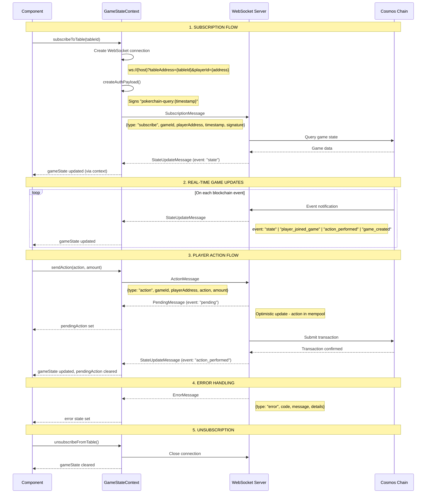

# WebSocket Communication Sequence Diagram

This document describes the WebSocket communication between the Poker VM Frontend and the Cosmos backend, including all message shapes (DTOs).

## High-Level Architecture

```
┌─────────────┐     ┌──────────────────┐     ┌─────────────────┐     ┌──────────────┐
│   React     │────▶│ GameStateContext │────▶│    WebSocket    │────▶│   Cosmos     │
│ Components  │◀────│     Provider     │◀────│     Server      │◀────│  Blockchain  │
└─────────────┘     └──────────────────┘     └─────────────────┘     └──────────────┘
```

## Sequence Diagram



## Message Types & DTOs

### 1. Client → Server Messages

#### SubscriptionMessage
Sent when subscribing to a table for real-time updates.

```typescript
interface SubscriptionMessage {
    type: "subscribe";
    gameId: string;            // Table/game address
    playerAddress: string;     // Player's Cosmos address
    timestamp: number;         // Unix timestamp (seconds)
    signature: string;         // EIP-191 signed message
}
```

**Signature format:**
- Message: `"pokerchain-query:{timestamp}"`
- Signed using Ethereum personal_sign (EIP-191)
- HD Path: `m/44'/118'/0'/0/0` (Cosmos derivation)

#### ActionMessage
Sent when a player performs an action.

```typescript
interface ActionMessage {
    type: "action";
    gameId: string;            // Table/game address
    playerAddress: string;     // Player's Cosmos address
    action: string;            // Action type (see PlayerActionType)
    amount?: string;           // Bet/raise amount (BigInt string)
}
```

### 2. Server → Client Messages

#### StateUpdateMessage
Received for game state updates.

```typescript
interface StateUpdateMessage {
    // Event type
    event: "state" | "player_joined_game" | "action_performed" | "game_created";
    gameId: string;

    // Game state (one of these will be present)
    gameState?: TexasHoldemStateDTO;
    data?: {
        gameState?: TexasHoldemStateDTO;
        format?: string;
        variant?: string;
    };
    game?: {
        gameState?: TexasHoldemStateDTO;
        format?: string;
        variant?: string;
    };

    // Format info (at root or nested)
    format?: GameFormat;
    variant?: GameVariant;
}
```

**Legacy format (type-based):**
```typescript
interface LegacyStateUpdateMessage {
    type: "gameStateUpdate";
    tableAddress: string;
    gameState: TexasHoldemStateDTO;
}
```

#### PendingMessage
Optimistic update when action is accepted but not yet confirmed.

```typescript
interface PendingMessage {
    event: "pending";
    gameId: string;
    data: {
        gameId?: string;
        actor: string;         // Player address who acted
        action: string;        // Action performed
        amount?: string;       // Amount if applicable
    };
}
```

#### ActionAcceptedMessage
Acknowledgment that action was accepted.

```typescript
interface ActionAcceptedMessage {
    event: "action_accepted";
}
```

#### ErrorMessage
Error response from server.

```typescript
interface ErrorMessage {
    type: "error" | undefined;
    event: "error" | undefined;
    code: string;              // Error code (e.g., "GAME_NOT_FOUND")
    message: string;           // Human-readable message
    details?: {
        suggestion?: string;   // Suggested action
    };
}
```

## Core DTOs (Data Transfer Objects)

### TexasHoldemStateDTO
The main game state object returned from the server.

```typescript
interface TexasHoldemStateDTO {
    gameOptions: GameOptionsDTO;
    smallBlindPosition?: number;
    bigBlindPosition?: number;
    dealer?: number;
    players: PlayerDTO[];
    communityCards: string[];      // Card mnemonics: ["AS", "KH", "2C"]
    deck: string;                  // Encrypted deck string
    pots: string[];                // Pot amounts (BigInt strings)
    lastActedSeat?: number;
    nextToAct: number;
    previousActions: ActionDTO[];
    actionCount: number;
    handNumber: number;
    round: TexasHoldemRound;
    winners: WinnerDTO[];
    results: ResultDTO[];
    signature: string;
}
```

### GameOptionsDTO
Table configuration options.

```typescript
interface GameOptionsDTO {
    minBuyIn?: string;             // BigInt string (USDC microunits for cash)
    maxBuyIn?: string;             // BigInt string
    minPlayers?: number;
    maxPlayers?: number;
    smallBlind?: string;           // BigInt string
    bigBlind?: string;             // BigInt string
    timeout?: number;              // Action timeout in seconds
    rake?: RakeConfigDTO;
    owner?: string;                // Table owner address
    startingStack?: string;        // Tournament starting chips
    blindLevelDuration?: number;   // Minutes per blind level
    format?: GameFormat;           // "cash" | "sit-and-go" | "tournament"
    otherOptions?: Record<string, any>;
}
```

### PlayerDTO
Player state at the table.

```typescript
interface PlayerDTO {
    address: string;
    seat: number;
    stack: string;                 // BigInt string
    isSmallBlind: boolean;
    isBigBlind: boolean;
    isDealer: boolean;
    holeCards: string[] | undefined;  // Only visible for current player or at showdown
    status: PlayerStatus;
    lastAction: ActionDTO | undefined;
    legalActions: LegalActionDTO[];
    sumOfBets: string;             // Total bet this hand
    timeout: number;
    signature: string;
}
```

### ActionDTO
Represents a player action.

```typescript
interface ActionDTO {
    playerId: string;
    seat: number;
    action: PlayerActionType | NonPlayerActionType;
    amount: string;                // BigInt string
    round: TexasHoldemRound;
    index: number;                 // Action sequence number
    timestamp: number;
}
```

### LegalActionDTO
Available action for a player.

```typescript
interface LegalActionDTO {
    action: PlayerActionType | NonPlayerActionType;
    min: string | undefined;       // Minimum amount (for bet/raise)
    max: string | undefined;       // Maximum amount (for bet/raise)
    index: number;                 // Expected action index
}
```

### WinnerDTO
Hand winner information.

```typescript
interface WinnerDTO {
    address: string;
    amount: string;                // Won amount (BigInt string)
    cards: string[] | undefined;   // Winning cards
    name: string | undefined;      // Hand name (e.g., "Full House")
    description: string | undefined;
}
```

### ResultDTO
Tournament/SNG placement result.

```typescript
interface ResultDTO {
    place: number;                 // 1st, 2nd, etc.
    playerId: string;
    payout: string;                // Prize amount (BigInt string)
}
```

### RakeConfigDTO
Rake configuration.

```typescript
interface RakeConfigDTO {
    rakeFreeThreshold: string;     // Hands below this are rake-free
    rakePercentage: number;        // Percentage (e.g., 5 for 5%)
    rakeCap: string;               // Maximum rake amount
    owner?: string;                // Rake recipient address
}
```

## Enums

### GameFormat
```typescript
enum GameFormat {
    CASH = "cash",
    SIT_AND_GO = "sit-and-go",
    TOURNAMENT = "tournament"
}
```

### GameVariant
```typescript
enum GameVariant {
    TEXAS_HOLDEM = "texas-holdem",
    OMAHA = "omaha"
}
```

### TexasHoldemRound
```typescript
enum TexasHoldemRound {
    ANTE = "ante",
    PREFLOP = "preflop",
    FLOP = "flop",
    TURN = "turn",
    RIVER = "river",
    SHOWDOWN = "showdown",
    END = "end"
}
```

### PlayerStatus
```typescript
enum PlayerStatus {
    ACTIVE = "active",
    BUSTED = "busted",
    FOLDED = "folded",
    ALL_IN = "all-in",
    SEATED = "seated",
    SITTING_OUT = "sitting-out",
    SITTING_IN = "sitting-in",
    SHOWING = "showing",
    WAITING = "waiting"
}
```

### PlayerActionType
```typescript
enum PlayerActionType {
    SMALL_BLIND = "post-small-blind",
    BIG_BLIND = "post-big-blind",
    FOLD = "fold",
    CHECK = "check",
    BET = "bet",
    CALL = "call",
    RAISE = "raise",
    ALL_IN = "all-in",
    MUCK = "muck",
    SHOW = "show"
}
```

### NonPlayerActionType
```typescript
enum NonPlayerActionType {
    DEAL = "deal",
    JOIN = "join",
    LEAVE = "leave",
    NEW_HAND = "new-hand",
    SIT_IN = "sit-in",
    SIT_OUT = "sit-out",
    TOP_UP = "top-up"
}
```

## Data Flow Summary

```
┌────────────────────────────────────────────────────────────────────────────┐
│                           FRONTEND DATA FLOW                                │
├────────────────────────────────────────────────────────────────────────────┤
│                                                                             │
│   WebSocket Message                                                         │
│         │                                                                   │
│         ▼                                                                   │
│   extractGameDataFromMessage()  ──▶  { gameState, format, variant }        │
│         │                                                                   │
│         ▼                                                                   │
│   validateGameState()           ──▶  Check required fields                 │
│         │                                                                   │
│         ▼                                                                   │
│   GameStateContext.setState()                                               │
│         │                                                                   │
│         ├──▶ gameState: TexasHoldemStateDTO                                │
│         ├──▶ gameFormat: GameFormat                                        │
│         └──▶ gameVariant: GameVariant                                      │
│                                                                             │
│         │                                                                   │
│         ▼                                                                   │
│   useGameStateContext()         ──▶  Components access state               │
│         │                                                                   │
│         ├──▶ useTableData()     ──▶  Table-level data                     │
│         ├──▶ usePlayerData()    ──▶  Per-seat player data                 │
│         └──▶ usePlayerLegalActions() ──▶ Available actions                │
│                                                                             │
└────────────────────────────────────────────────────────────────────────────┘
```

## WebSocket Connection URL

```
ws://{host}?tableAddress={tableId}&playerId={playerAddress}
```

| Parameter | Description |
|-----------|-------------|
| `host` | WebSocket server from `currentNetwork.ws` |
| `tableAddress` | The game/table ID (Cosmos address) |
| `playerId` | Player's Cosmos address |

## Important Notes

### Value Types
- All monetary values are **BigInt strings** (e.g., `"1000000"`)
- Cash games use **USDC microunits** (6 decimals): `1000000` = $1.00
- Tournaments use **chip units** (no decimals): `1500` = 1500 chips

### Card Mnemonics
Cards use 2-character mnemonics:
- Ranks: `A` (ace), `2-9`, `T` (ten), `J` (jack), `Q` (queen), `K` (king)
- Suits: `C` (clubs), `D` (diamonds), `H` (hearts), `S` (spades)
- Examples: `AS` (ace of spades), `KH` (king of hearts), `2C` (two of clubs)

### Hole Card Visibility
- `holeCards` in `PlayerDTO` is only populated for:
  1. The currently subscribed player (authenticated via signature)
  2. All remaining players at showdown
- Other players' cards appear as `undefined` or empty array

### Optimistic Updates
The frontend uses optimistic updates for better UX:
1. Action sent → `pendingAction` set immediately
2. `pending` event received → confirms action in mempool
3. State update received → `pendingAction` cleared, `gameState` updated

---

Last Updated: 2026-02-04
